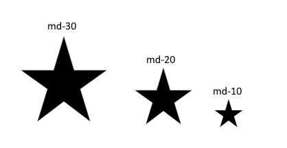
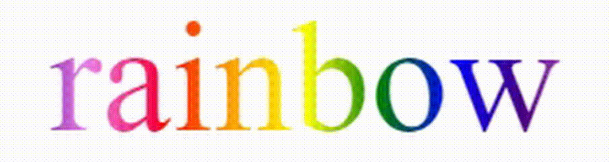

# API
Here you will find various API that you can use freely.

# Index

- [index](#index)
- [Google Icon Style](#google-icon-style)
- [Rainbow Text](#rainbow-text)

# Google Icon Style
###
Change the size or color of Google icons <br/> 
[Google Fonts Icons](https://fonts.google.com/icons)

You need to put this in the head `<head>` firstv 
```html
<link rel="stylesheet" href="https://fonts.googleapis.com/css2?family=Material+Symbols+Outlined:opsz,wght,FILL,GRAD@20..48,100..700,0..1,-50..200" />
```

As a second step you also link this code in your head `<head>`
```html
<link rel="stylesheet" href="https://developerweb-online.netlify.app/api/css/google-icon-style.css" />
```
###
And now you can use the `md-` tag to resize the icon
```html
<span class="material-symbols-outlined md-10">
star
</span>
```



### Icon Color
You can also change the color of an icon yes the tags are listed here
- `md-green`
- `md-blue`
- `md-red`
###
- `md-black`
- `md-light`


# Rainbow Text
###
You can use this to create a rainbow text, you must first insert this link in the head `<head>`
```html
<link rel="stylesheet" href="https://developerweb-online.netlify.app/api/css/rainbow-text.css" />
```

In the second step you can create a rainbow text
```html
<span class="rainbowtext">rainbow
</span>
```


### Rainbow Text Animation
With the tag `a-` you can make an animation
```html
<span class="rainbowtext a-1">rainbow
</span>
```


```html
<span class="rainbowtext a-5">rainbow
</span>
```


It goes from `a-0` to `a-10`

### Rainbow Text Font

You can also change the font using the `arial` or `bold` tags

- `arial` The tag passes the font arial
- `bold` The tag makes the writing thicker